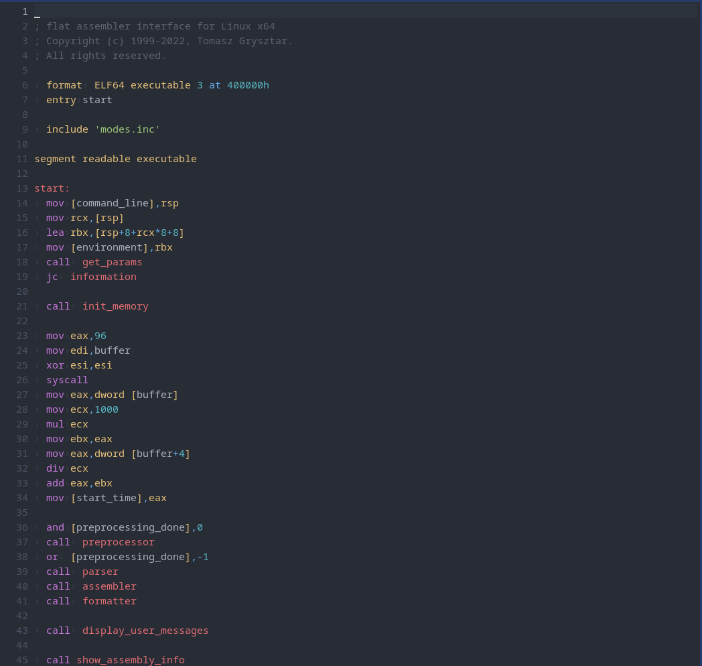

# flat assembler


### x86_64 Assembler for GNU/Linux

# Build
This already include a version pre assembled in ./bin
```
./bin/fasm fasm.s
```
or you can use GNU Make
```
make
```

## Installation

```
sudo make install
```

This will install in /usr/bin
